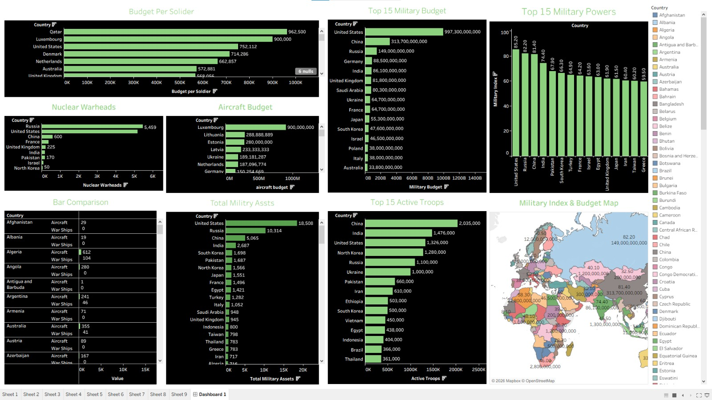

# 🌍 Military Data Analysis & Dashboard

This project is an end-to-end data project combining web scraping, data analysis, and visualization.

## 🔎 Objective

Analyze global military data to discover insights about budgets, troops, and power.

## ⚙️ Workflow

* Web Scraping using Python
* Data Cleaning & Processing
* Exploratory Data Analysis
* Tableau Dashboard Visualization

## 📊 Key Insights

* USA has the highest military budget
* China & India lead in active troops
* Nuclear weapons are limited to few countries

## 🛠 Tools

Python | Pandas | BeautifulSoup | Tableau

## 📸 Dashboard

## 👨‍💻 Author

Mohamed Moustafa
